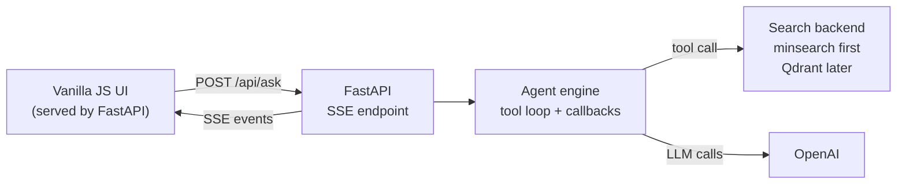

# Deploy Your AI Agent Project with FastAPI

This workshop is a part of [AI Shipping Labs](https://luma.com/j1zzd47e).

* Event: https://luma.com/j1zzd47e

Many AI projects stop at "it works in my notebook". In this workshop we start in a notebook, turn that flow into regular Python, split the agent logic from the web layer, deploy the simple version first, and only then upgrade retrieval to Qdrant.

## What We Will Build



### What Each Piece Does

- `notebook.py`: the notebook-style version of the workshop flow. Load data, build search, ask a question, print the agent trace.
- `engine.py`: reusable agent logic. It runs the tool-calling loop and emits events through callbacks.
- `app.py`: FastAPI routes plus Server-Sent Events plumbing.
- `search.py`: the retrieval layer. It starts with `minsearch` and can switch to Qdrant by changing `SEARCH_BACKEND`.
- `frontend/`: small static UI that renders the token stream and the agent trace.
- `ingest.py`: only needed for the Qdrant upgrade path.

## Prerequisites

- Python 3.13+
- OpenAI API key
- Docker for packaging
- Qdrant only if you want the vector-search upgrade later

## Environment Setup

We use [uv](https://docs.astral.sh/uv/):

```bash
uv init agent-fastapi-vectordb
cd agent-fastapi-vectordb
uv add fastapi uvicorn sse-starlette openai minsearch qdrant-client fastembed requests
```

Put your OpenAI key in `.env`:

```bash
OPENAI_API_KEY=sk-...
```

## Part 1: Explore the FAQ in Jupyter

Start in a notebook. The goal is to make the data and the tool behavior obvious before we add FastAPI, SSE, or Docker.

### Load the FAQ

The DataTalks.Club FAQ is published as JSON. Each entry has:

- `id`
- `course`
- `section`
- `question`
- `answer`

In a notebook the first step is just loading the rows:

```python
import requests

base = "https://datatalks.club/faq"
courses = requests.get(f"{base}/json/courses.json").json()

documents = []
for course in courses:
    course_data = requests.get(f"{base}/{course['path']}").json()
    documents.extend(course_data)

len(documents)
```

### Build a Simple Search Index with `minsearch`

For the first version, keep search fully in memory:

```python
from minsearch import AppendableIndex

index = AppendableIndex(
    text_fields=["question", "answer", "section"],
    keyword_fields=["course"],
)

index.fit(documents)
```

And wrap it in a small search function:

```python
def search(query, limit=5):
    """Search the FAQ for one course using the in-memory minsearch index.

    Args:
        query: Student question to look up.
        limit: Maximum number of matching FAQ entries to return.

    Returns:
        A list of matching FAQ documents.
    """
    course = 'data-engineering-zoomcamp'

    return index.search(
        query=query,
        filter_dict={"course": course},
        boost_dict={"question": 3.0, "section": 0.5, "answer": 1.0},
        num_results=limit,
    )
```

### Add a Tool and Run the Agent Loop

The model gets one tool, `search(query)`, and uses it until it has enough context to answer.

To talk to OpenAI, import the async client and define the model settings we want to use:

```python
import json
from openai import AsyncOpenAI

openai_client = AsyncOpenAI()
MODEL_NAME = "gpt-4o-mini"
```

We use `AsyncOpenAI` because the model response arrives as a live stream, not as one big finished string. The notebook listens to that stream event by event, so the async client is the natural fit. It also keeps the notebook version aligned with the FastAPI version we build later, where the server is already working in an async style.

Now define the tool schema. This is what the model sees when it decides whether to call `search`:

```python
search_tool = {
    "type": "function",
    "name": "search",
    "description": "Search the course FAQ.",
    "parameters": {
        "type": "object",
        "properties": {
            "query": {"type": "string"},
        },
        "required": ["query"],
        "additionalProperties": False,
    },
}
```

We also need a system prompt that tells the model how to use the FAQ:

```python
INSTRUCTIONS = """
You're a teaching assistant for DataTalks.Club zoomcamps.

Answer the user's question using the FAQ knowledge base. Use the `search`
tool to look things up. You can call search multiple times with different
queries to explore the topic well.

Rules:
- Use only facts from the search results.
- If the answer isn't in the results, say so clearly.
- At the end, list the FAQ entries you used under a "Sources" section,
  one per line in the form: `- [id] section > question`.
""".strip()
```

Instead of jumping straight to `run_agent(...)`, start with one request by hand. First prepare the question and the initial message history:

```python
question = "I just discovered the course, can I still join?"

message_history = [
    {"role": "system", "content": INSTRUCTIONS},
    {"role": "user", "content": question},
]
```

Now run the model call in its own cell. This cell opens a streaming response from OpenAI, and the loop processes each event as it arrives, printing text tokens immediately instead of waiting for the whole response to finish:

```python
async with openai_client.responses.stream(
    model=MODEL_NAME,
    input=message_history,
    tools=[search_tool],
) as stream:
    response = await stream.get_final_response()
```


Now let's implement the tool call loop:

```python
for item in response.output:
    if item.type != "function_call":
        continue

    print(item)

    args = json.loads(item.arguments)
    result = search(**args)

    message_history.append({
        "type": "function_call",
        "call_id": item.call_id,
        "name": item.name,
        "arguments": item.arguments,
    })

    message_history.append({
        "type": "function_call_output",
        "call_id": item.call_id,
        "output": json.dumps(result),
    })
```

After that, run one more cell to ask again with the updated history:

```python
async with openai_client.responses.stream(
    model=MODEL_NAME,
    input=message_history,
    tools=[search_tool],
) as stream:
    async for event in stream:
        if event.type == "response.output_text.delta":
            print(event.delta, end="", flush=True)

    response = await stream.get_final_response()
```

Once that makes sense, we can package it into a loop.

To make notebook output readable, define a small renderer class. It dispatches each event type to a dedicated handler:

```python
class NotebookRenderer:
    async def handle_event(self, event_type, payload):
        handler = getattr(self, f"handle_{event_type}", self.handle_unknown)
        await handler(payload)

    async def handle_status(self, payload):
        print(f"[{payload['message']}]")

    async def handle_iteration(self, payload):
        print(f"\n--- iteration {payload['n']} ---")

    async def handle_tool_call(self, payload):
        print(f"\n[tool_call] {payload['name']}({payload['arguments']})")

    async def handle_tool_result(self, payload):
        count = len(payload["result"]) if isinstance(payload["result"], list) else "?"
        print(f"[tool_result] {payload['name']} -> {count} hits")

    async def handle_token(self, payload):
        print(payload["delta"], end="", flush=True)

    async def handle_done(self, payload):
        print(f"\n\n[done]\n{payload['answer']}")

    async def handle_unknown(self, payload):
        print(payload)


renderer = NotebookRenderer()
```

Next add a helper that wraps the model call. It takes the current history and the renderer, streams tokens as they arrive, and returns the final response object:

```python
async def request_response(message_history, renderer):
    async with openai_client.responses.stream(
        model=MODEL_NAME,
        input=message_history,
        tools=[search_tool],
    ) as stream:
        async for event in stream:
            if event.type == "response.output_text.delta":
                await renderer.handle_event("token", {"delta": event.delta})

        return await stream.get_final_response()
```

Now add a helper that appends tool messages in the safe format. We append plain dicts here, not the raw SDK objects from `response.output`:

```python
def append_tool_messages(message_history, item, result):
    message_history.append({
        "type": "function_call",
        "call_id": item.call_id,
        "name": item.name,
        "arguments": item.arguments,
    })

    message_history.append({
        "type": "function_call_output",
        "call_id": item.call_id,
        "output": json.dumps(result),
    })
```

Then add one helper that executes every tool call from a response and reports progress through the renderer:

```python
async def handle_tool_calls(response, message_history, renderer):
    has_tool_calls = False

    for item in response.output:
        if item.type != "function_call":
            continue

        has_tool_calls = True

        args = json.loads(item.arguments)
        await renderer.handle_event(
            "tool_call",
            {"name": item.name, "arguments": args},
        )

        result = search(**args)
        await renderer.handle_event(
            "tool_result",
            {"name": item.name, "result": result},
        )

        append_tool_messages(message_history, item, result)

    return has_tool_calls
```

We also need a tiny helper to extract the final answer once the model stops calling tools:

```python
def collect_answer(response):
    answer = ""

    for item in response.output:
        if item.type != "message":
            continue

        for content in item.content:
            if getattr(content, "text", None):
                answer += content.text

    return answer
```

Now `run_agent(...)` becomes much smaller because it only orchestrates those helpers:

```python
MAX_ITERATIONS = 5


async def run_agent(question, renderer):
    await renderer.handle_event("status", {"message": "thinking..."})
    message_history = [
        {"role": "system", "content": INSTRUCTIONS},
        {"role": "user", "content": question},
    ]

    for iteration in range(1, MAX_ITERATIONS + 1):
        await renderer.handle_event("iteration", {"n": iteration})

        response = await request_response(message_history, renderer)
        has_tool_calls = await handle_tool_calls(response, message_history, renderer)

        if not has_tool_calls:
            answer = collect_answer(response)
            await renderer.handle_event("done", {"answer": answer})
            return

    await renderer.handle_event("done", {"answer": "(stopped: reached max iterations)"})
```

With that in place, run one example question. In Jupyter you can use top-level `await` directly:

```python
await run_agent("I just discovered the course, can I still join?", renderer)
```

You should see:

- status events
- iteration markers
- tool calls and tool results
- streamed tokens
- the final answer


## Part 2: Split the Notebook into Modules

Once the notebook version works, split it into clear responsibilities.

### `engine.py`

`engine.py` owns the agent behavior:

- building the message history
- streaming tokens from the model
- extracting tool calls
- executing tools
- emitting progress events through a renderer object

The important change is that the engine does not know anything about SSE or FastAPI. It only talks to a renderer:

```python
await renderer.handle_event("token", {"delta": "..."})
await renderer.handle_event("tool_call", {"name": "search", "arguments": {...}})
```

That makes the same engine reusable from:

- `notebook.py`
- `app.py`
- tests
- a future CLI or batch job

### `app.py`

`app.py` is now thin:

- define the FastAPI routes
- create an `SseRenderer` that turns engine events into SSE messages
- serve the static frontend

The key point is that `app.py` uses the same renderer idea as the notebook. In the notebook, `NotebookRenderer` prints things to the output cell. In the web app, `SseRenderer` pushes the same events into a queue and streams them to the browser as Server-Sent Events.

That keeps the web entrypoint small: the engine still does the agent work, and `app.py` only adapts those events for the frontend. The existing frontend keeps working because `/api/ask` still streams the same event types and `/api/courses` still provides the course list for the selector.

## Part 3: Stream the Agent to the Browser

We use Server-Sent Events because the browser only needs a one-way stream from the server.

The frontend receives events such as:

- `status`
- `iteration`
- `token`
- `tool_call`
- `tool_result`
- `done`

Run the app locally:

```bash
uv run uvicorn app:app --host 0.0.0.0 --port 9696 --reload
```

Then open `http://localhost:9696`.

The UI in [frontend/app.js](frontend/app.js) manually parses the SSE stream from a `fetch()` request so we can keep `POST /api/ask`.

## Part 4: Package and Deploy the Simple Version

The first deployment does not need Qdrant at all. The app can boot with the default in-memory search backend:

```bash
SEARCH_BACKEND=minsearch
```

### Docker

Build the image:

```bash
docker build -t agent-fastapi-vectordb .
```

Run it:

```bash
docker run --rm -p 9696:9696 \
  -e OPENAI_API_KEY="$OPENAI_API_KEY" \
  agent-fastapi-vectordb
```

### Docker Compose

For the default version:

```bash
docker compose up --build
```

### Fly.io

Launch the app:

```bash
fly launch --no-deploy --name agent-fastapi-vectordb
fly secrets set OPENAI_API_KEY="sk-..."
fly deploy
```

At this point the workshop is already deployable.

## Part 5: Upgrade Search to Qdrant

After the basic version works, switch the retrieval layer from `minsearch` to Qdrant.

### Start Qdrant

Locally:

```bash
docker compose --profile qdrant up -d qdrant
```

Or use Qdrant Cloud.

### Ingest the FAQ into Qdrant

[ingest.py](ingest.py) reuses the same FAQ loader, creates the collection, and indexes documents with `fastembed`:

```bash
QDRANT_URL=http://localhost:6333 uv run python ingest.py
```

### Switch the App to Qdrant

Set:

```bash
SEARCH_BACKEND=qdrant
QDRANT_URL=http://localhost:6333
```

Now the same `search()` tool goes through the Qdrant backend instead of the in-memory one.

With Docker Compose:

```bash
SEARCH_BACKEND=qdrant docker compose --profile qdrant up --build
```

For Fly.io with Qdrant Cloud:

```bash
fly secrets set \
  OPENAI_API_KEY="sk-..." \
  SEARCH_BACKEND="qdrant" \
  QDRANT_URL="https://<your-cluster>.qdrant.io:6333" \
  QDRANT_API_KEY="<your-key>"

fly deploy
```

## Where to Go From Here

- Add more tools beyond FAQ search
- Store conversations
- Add auth
- Add evaluation cases for the agent
- Replace the static frontend with a richer client if you need it

## Summary

This workshop now follows the progression we usually want in practice:

1. Explore the idea in Jupyter.
2. Turn the notebook into `notebook.py`.
3. Extract reusable agent logic into `engine.py`.
4. Keep `app.py` focused on FastAPI and SSE.
5. Deploy the simple `minsearch` version first.
6. Upgrade the search backend to Qdrant only after the app shape is already solid.
