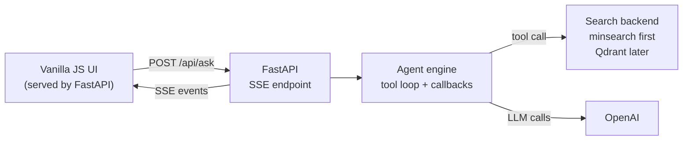

# Deploy Your AI Agent Project with FastAPI

This workshop is a part of [AI Shipping Labs](https://luma.com/j1zzd47e).

* Event: https://luma.com/j1zzd47e
* Video: [TODO: Add YouTube link]
* Code: [notebook.py](notebook.py), [engine.py](engine.py), [app.py](app.py), [search.py](search.py), [ingest.py](ingest.py), [frontend/](frontend/)

Many AI projects stop at "it works in my notebook". In this workshop we start in a notebook, turn that flow into regular Python, split the agent logic from the web layer, deploy the simple version first, and only then upgrade retrieval to Qdrant.

## What We Will Build



### What Each Piece Does

- `notebook.py`: the notebook-style version of the workshop flow. Load data, build search, ask a question, print the agent trace.
- `engine.py`: reusable agent logic. It runs the tool-calling loop and emits events through callbacks.
- `app.py`: FastAPI routes plus Server-Sent Events plumbing.
- `search.py`: the retrieval layer. It starts with `minsearch` and can switch to Qdrant by changing `SEARCH_BACKEND`.
- `frontend/`: small static UI that renders the token stream and the agent trace.
- `ingest.py`: only needed for the Qdrant upgrade path.

## Prerequisites

- Python 3.13+
- OpenAI API key
- Docker for packaging
- Qdrant only if you want the vector-search upgrade later

## Environment Setup

We use [uv](https://docs.astral.sh/uv/):

```bash
uv init agent-fastapi-vectordb
cd agent-fastapi-vectordb
uv add fastapi uvicorn sse-starlette openai minsearch qdrant-client fastembed requests
```

Put your OpenAI key in `.env`:

```bash
OPENAI_API_KEY=sk-...
```

## Part 1: Explore the FAQ in Jupyter

Start in a notebook. The goal is to make the data and the tool behavior obvious before we add FastAPI, SSE, or Docker.

### Step 1: Load the FAQ

The DataTalks.Club FAQ is published as JSON. Each entry has:

- `id`
- `course`
- `section`
- `question`
- `answer`

In a notebook the first step is just loading the rows:

```python
import requests

base = "https://datatalks.club/faq"
courses = requests.get(f"{base}/json/courses.json").json()

documents = []
for course in courses:
    course_data = requests.get(f"{base}/{course['path']}").json()
    documents.extend(course_data)

len(documents)
```

### Step 2: Build a Simple Search Index with `minsearch`

For the first version, keep search fully in memory:

```python
from minsearch import AppendableIndex

index = AppendableIndex(
    text_fields=["question", "answer", "section"],
    keyword_fields=["course"],
)

index.fit(documents)
```

And wrap it in a small search function:

```python
def search(query, course=None, limit=5):
    kwargs = {
        "query": query,
        "boost_dict": {"question": 3.0, "section": 0.5, "answer": 1.0},
        "num_results": limit,
    }
    if course:
        kwargs["filter_dict"] = {"course": course}
    return index.search(**kwargs)
```

### Step 3: Add a Tool and Run the Agent Loop

The model gets one tool, `search(query, course=None)`, and uses it until it has enough context to answer.

That notebook flow is captured in [notebook.py](notebook.py), which is the "turn the notebook into Python" step:

```bash
uv run python notebook.py
```

You should see:

- status events
- iteration markers
- tool calls and tool results
- streamed tokens
- the final answer

## Part 2: Split the Notebook into Modules

Once the notebook version works, split it into clear responsibilities.

### `engine.py`

`engine.py` owns the agent behavior:

- building the message history
- streaming tokens from the model
- extracting tool calls
- executing tools
- emitting progress events through a callback

The important change is that the engine does not know anything about SSE or FastAPI. It only calls:

```python
await on_event("token", {"delta": "..."})
await on_event("tool_call", {"name": "search", "arguments": {...}})
```

That makes the same engine reusable from:

- `notebook.py`
- `app.py`
- tests
- a future CLI or batch job

### `app.py`

`app.py` is now thin:

- define the FastAPI routes
- turn engine callback events into SSE messages
- serve the static frontend

This separation keeps `run_agent` small in the web layer and moves the real logic into reusable pieces.

## Part 3: Stream the Agent to the Browser

We use Server-Sent Events because the browser only needs a one-way stream from the server.

The frontend receives events such as:

- `status`
- `iteration`
- `token`
- `tool_call`
- `tool_result`
- `done`

Run the app locally:

```bash
uv run uvicorn app:app --host 0.0.0.0 --port 9696 --reload
```

Then open `http://localhost:9696`.

The UI in [frontend/app.js](frontend/app.js) manually parses the SSE stream from a `fetch()` request so we can keep `POST /api/ask`.

## Part 4: Package and Deploy the Simple Version

The first deployment does not need Qdrant at all. The app can boot with the default in-memory search backend:

```bash
SEARCH_BACKEND=minsearch
```

### Docker

Build the image:

```bash
docker build -t agent-fastapi-vectordb .
```

Run it:

```bash
docker run --rm -p 9696:9696 \
  -e OPENAI_API_KEY="$OPENAI_API_KEY" \
  agent-fastapi-vectordb
```

### Docker Compose

For the default version:

```bash
docker compose up --build
```

### Fly.io

Launch the app:

```bash
fly launch --no-deploy --name agent-fastapi-vectordb
fly secrets set OPENAI_API_KEY="sk-..."
fly deploy
```

At this point the workshop is already deployable.

## Part 5: Upgrade Search to Qdrant

After the basic version works, switch the retrieval layer from `minsearch` to Qdrant.

### Step 1: Start Qdrant

Locally:

```bash
docker compose --profile qdrant up -d qdrant
```

Or use Qdrant Cloud.

### Step 2: Ingest the FAQ into Qdrant

[ingest.py](ingest.py) reuses the same FAQ loader, creates the collection, and indexes documents with `fastembed`:

```bash
QDRANT_URL=http://localhost:6333 uv run python ingest.py
```

### Step 3: Switch the App to Qdrant

Set:

```bash
SEARCH_BACKEND=qdrant
QDRANT_URL=http://localhost:6333
```

Now the same `search()` tool goes through the Qdrant backend instead of the in-memory one.

With Docker Compose:

```bash
SEARCH_BACKEND=qdrant docker compose --profile qdrant up --build
```

For Fly.io with Qdrant Cloud:

```bash
fly secrets set \
  OPENAI_API_KEY="sk-..." \
  SEARCH_BACKEND="qdrant" \
  QDRANT_URL="https://<your-cluster>.qdrant.io:6333" \
  QDRANT_API_KEY="<your-key>"

fly deploy
```

## Where to Go From Here

- Add more tools beyond FAQ search
- Store conversations
- Add auth
- Add evaluation cases for the agent
- Replace the static frontend with a richer client if you need it

## Summary

This workshop now follows the progression we usually want in practice:

1. Explore the idea in Jupyter.
2. Turn the notebook into `notebook.py`.
3. Extract reusable agent logic into `engine.py`.
4. Keep `app.py` focused on FastAPI and SSE.
5. Deploy the simple `minsearch` version first.
6. Upgrade the search backend to Qdrant only after the app shape is already solid.
