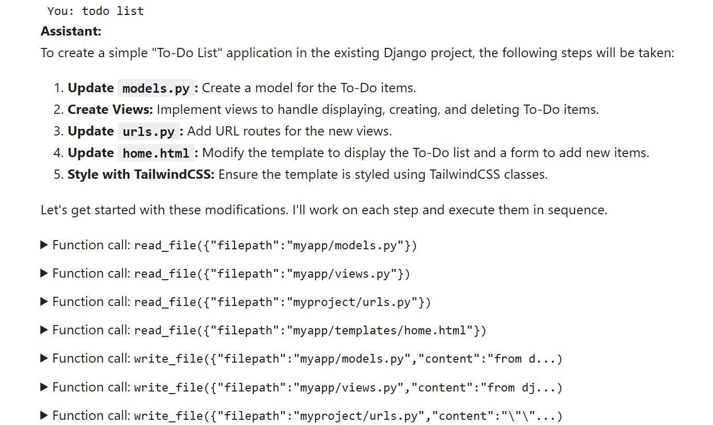
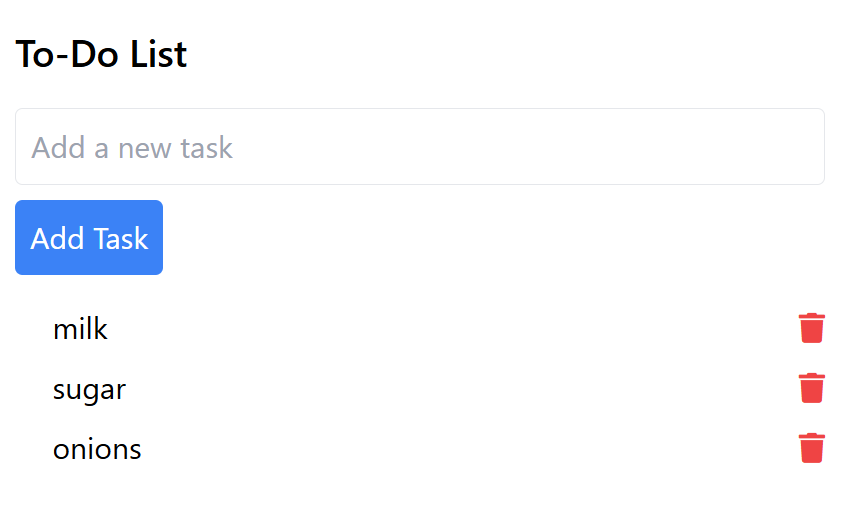

# Create a Coding Agent

In this workshop, we create our own coding Agent. This agent
will use the provided Django template and create an application
using it.

In the ["Vibe Coding Introduction" workshop](../vibe-coding/), we referred
to such tools as "Project Bootstrapers". Now we're building one of them
ourselves.






## Prerequisites

- Python
- Make (optionally)
- OpenAI key 

## Django Template Project

Let's start a new Django project

```bash
mkdir django_template
cd django_template/

uv init
rm main.py

uv add django

uv run django-admin startproject myproject .
uv run python manage.py startapp myapp
```

Add the new app (`myapp`) into `myproject/settings.py`'s `INSTALLED_APPS`:

```python
INSTALLED_APPS = [
    # ... other apps
    'myapp',
]
```

For our convenience, we can have a `Makefile` with useful commands:

```makefile
.PHONY: install migrate run

install:
	uv sync --dev

migrate:
	uv run python manage.py migrate

run:
	uv run python manage.py runserver
```

Next, create the base html template in `templates/base.html`:

```html
<!DOCTYPE html>
<html lang="en">
<head>
    <meta charset="UTF-8">
    <meta name="viewport" content="width=device-width, initial-scale=1.0">
    <title></title>
</head>
<body>
    
</body>
</html>
```

Add this templates directory to the settings file:

```python
TEMPLATES = [{
    'DIRS': [BASE_DIR / 'templates'],
    ...
}
```

Now we're ready to create the home view for our app:

```python
# myapp/views.py
def home(request):
    return render(request, 'home.html')

# myproject/urls.py
from myapp import views

urlpatterns = [
    # ...
    path('', views.home, name='home'),
]
```

HTML code for `myapp/templates/home.html`:

```html



<h1>Home</h1>

```


Finally, let's add TailwindCSS and Font-Awesome to our `base.html` template:

```html
<script src="https://cdn.tailwindcss.com"></script>
<link href="https://cdnjs.cloudflare.com/ajax/libs/font-awesome/5.15.1/css/all.min.css" rel="stylesheet">
```

We can update `base.html` with [this code](django_template/templates/base.html).

## Agent

Now let's create the code for our Agent. We'll do it inside a jupyter notebook.
See [agent.ipybn](agent.ipynb) for the final result.

First, we need a function to copy the template into a separate folder 

```python
import os
import shutil

def start():
    project_name = input("Enter the new Django project name: ").strip()
    if not project_name:
        print("Project name cannot be empty.")
        return

    if os.path.exists(project_name):
        print(f"Directory '{project_name}' already exists. Please choose a different name or remove the existing directory.")
        return

    shutil.copytree('django_template', project_name)
    print(f"Django template copied to '{project_name}' directory.")

    return project_name
```

This is how we use it:

```python
project_name = start()
```

Next, we need to define a few functions for the agent:

- Read file
- Write file
- Execute a bash command
- Potentially also: list files and grep

We will use ChatGPT (or Cursor) for creating these files

You can see the result in [tools.py](tools.py)

Note: for bash, you want to disable running "runserver" - if you
allow the agent to run it in Jupyter, it will hand up the environment.

So if we put the code inside a class `AgentTools`, we can use it like that:

```python
import tools
from pathlib import Path

project_path = Path(project_name)
agent_tools = tools.AgentTools(project_path)
```

Now, prompt. We start with something simple:


```python
DEVELOPER_PROMPT = """
You are a coding agent. Your task is to modify the provided
Django project template according to user instructions.
"""
```

Eventually we can get to something like that:

```python
DEVELOPER_PROMPT = """
You are a coding agent. Your task is to modify the provided Django project template
according to user instructions. You don't tell the user what to do; you do it yourself using the 
available tools. First, think about the sequence of steps you will do, and then 
execute the sequence.
Always ensure changes are consistent with Django best practices and the project’s structure.

## Project Overview

The project is a Django 5.2.4 web application scaffolded with standard best practices. It uses:
- Python 3.8+
- Django 5.2.4 (as specified in pyproject.toml)
- uv for Python environment and dependency management
- SQLite as the default database (see settings.py)
- Standard Django apps and a custom app called myapp
- HTML templates for rendering views
- TailwindCSS for styling

## File Tree


├── .python-version
├── README.md
├── manage.py
├── pyproject.toml
├── uv.lock
├── myapp/
│   ├── __init__.py
│   ├── admin.py
│   ├── apps.py
│   ├── migrations/
│   │   └── __init__.py
│   ├── models.py
│   ├── templates/
│   │   └── home.html
│   ├── tests.py
│   └── views.py
├── myproject/
│   ├── __init__.py
│   ├── asgi.py
│   ├── settings.py
│   ├── urls.py
│   └── wsgi.py
└── templates/
    └── base.html

## Content Description

- manage.py: Standard Django management script for running commands.
- README.md: Setup and run instructions, including use of uv for dependency management.
- pyproject.toml: Project metadata and dependencies (Django 5.2.4).
- uv.lock: Lock file for reproducible Python environments.
- .python-version: Specifies the Python version for the project.
- myapp/: Custom Django app with models, views, admin, tests, and a template (home.html).
  - migrations/: Contains migration files for database schema.
- myproject/: Django project configuration (settings, URLs, WSGI/ASGI entrypoints).
  - settings.py: Configures installed apps, middleware, database (SQLite), templates, etc.
- templates/: Project-level templates, including base.html.

You have full access to modify, add, or remove files and code within this structure using your available tools.


## Additional instructions

- Don't execute "runproject", but you can execute other commands to check if the project is working.
- Make sure you use Tailwind styles for making the result look beatiful
- Use pictograms and emojis when possible. Font-awesome is awailable
- Avoid putting complex logic to templates - do it on the server side when possible
"""
```


For orchestrating, we'll use [`toyaikit`](https://github.com/alexeygrigorev/toyaikit).
This is a library that I wrote based on the other workshops and our
courses, so if you watched them, you'll recognize what's happening insideю

Let's use it:

```python
from openai import OpenAI

from toyaikit.chat import ChatAssistant, OpenAIClient, IPythonChatInterface
from toyaikit.tools import Tools

tools_obj = Tools()
tools_obj.add_tools(agent_tools)

chat_interface = IPythonChatInterface()
openai_client = OpenAIClient(client=OpenAI())

chat_assistant = ChatAssistant(
    tools=tools_obj,
    developer_prompt=DEVELOPER_PROMPT,
    chat_interface=chat_interface,
    llm_client=openai_client
)

chat_assistant.run()
```

Now tell it about the app you want to implement!

After that, go to the project directory and run it:


```bash
make run
```

If it doesn't work - continue your conversation with the agent 
until it's fixed.

That's all!

